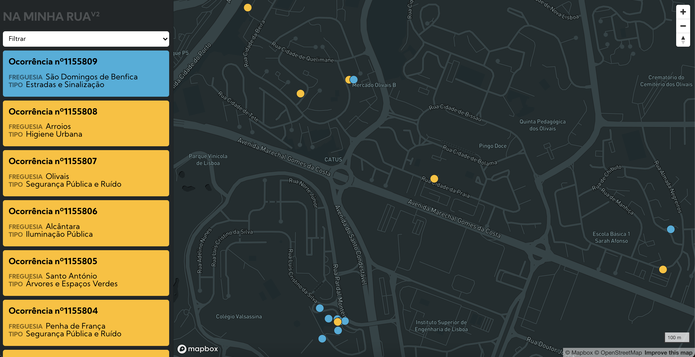

 

## Na Minha Rua V2 🇵🇹

### O que é?

Este site é um interface construído em javascript para a aplicação [Na Minha Rua](https://naminharualx.cm-lisboa.pt/), operada pela Câmara Municipal de Lisboa, que permite a qualquer cidadão registar problemas no espaço público. Esta versão permite a consulta das ocorrências registadas num interface mais amigável. Utilizando uma [Netlify function](https://www.netlify.com/products/functions/) baseada na [node-fetch](https://github.com/sanity-io/netlify-cli/blob/master/src/functions-templates/unused_ts/node-fetch/node-fetch.ts), a versão V2 vai buscar as últimas 500 ocorrências à API pública e lista-as como pontos num mapa produzido com o [Mapbox GL JS](https://github.com/mapbox/mapbox-gl-js) que carrega imediatamente. Ao carregar em qualquer marcador, é disponibilizado um _popup_ com detalhes da ocorrência. 

Os marcadores de ocorrência estão sincronizados com uma lista de cartões do lado esquerdo, e um filtro no canto superior esquerdo permite filtrar simultaneamente os cartões e os marcadores no mapa, por freguesia ou tipo de ocorrência. No final da listagem de cartões, um botão "Mais ocorrências" carrega o mapa e a lista com as 500 ocorrências seguintes, e assim sucessivamente. Esta versão está pronta para dispositivos móveis, orientando a lista de cartões em banda horizontal para permitir a navegação.

### Próximos objectivos
- Navegação de cartões com teclado
- Filtro simplificado e integrado no design da aplicação
- Correcção de precisão na localização do utilizador (Google Chrome)

### Websites
O website está alojado no Netlify em:   
https://ocorrencias-lx-mapa.netlify.app

Está também em desenvolvimento uma versão que dispõe os registos em _data table_
https://ocorrencias-lx.netlify.app

## Na Minha Rua V2 🇬🇧

### What is it (English)

This website is a interface built in javascript for the [Na Minha Rua](https://naminharualx.cm-lisboa.pt/) [_In My Street_] portal, which is operated by the Lisbon City Hall and enables citizen reporting of problems within public areas. Using a [Netlify function](https://www.netlify.com/products/functions/) adapted from [node-fetch](https://github.com/sanity-io/netlify-cli/blob/master/src/functions-templates/unused_ts/node-fetch/node-fetch.ts), the V2 version fetches the last 500 reports from the public API and lists them on a map that uses [Mapbox GL JS](https://github.com/mapbox/mapbox-gl-js) that loads immediately. By clicking on any marker, the user is presented with a popup with details of the report.

The report markers are synced with a cards list on the left sidebar, and a filter on the upper left corner allows for filtering both the cards and the markers, by parrish or type of report. At the end of the cards list, a "Mais ocorrências" [ _More occurrences_] button loads the map and the list with the next 500 reports. This version is ready for mobile devices, displaying the vertical cards list as a scrollable horizontal band to ease navigation.

### Upcoming goals
- Keyboard navigation for the cards list
- Simplified filter component, integrated with the application's design
- Correction to user location accuracy (in Google Chrome)

### Websites
This website is hosted by Netlify at:
https://ocorrencias-lx-mapa.netlify.app

Also in development: a version that displays the reports as a _data table_
https://ocorrencias-lx.netlify.app
